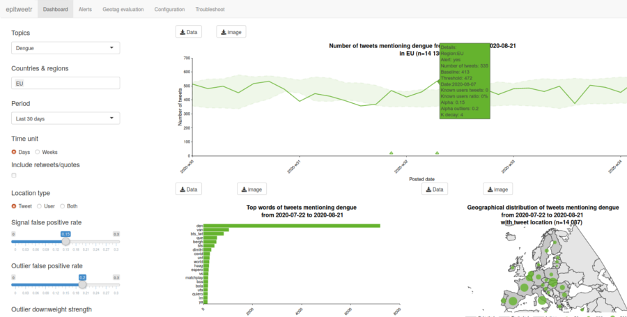

```{r, echo = FALSE}
knitr::opts_chunk$set(
  collapse = TRUE,
  comment = "#>"
)

library(epitweetr)
package_name <- "epitweetr"
package_desc <- packageDescription(package_name)
pkg_version <- package_desc$Version
pkg_date <- package_desc$Date
authors_str <- gsub("^ *|(?<= ) |\n| *$", "", package_desc$Authors, perl = TRUE)
author_list <- eval(parse(text = authors_str))
pkg_authors <- paste(
  format(
    author_list, 
    include = c("given", "family", "email", "comment"), 
    braces = list(email = c("<", ">,<br />"), 
    comment = c("", ""))
  ), 
  collapse = "<br /><br />"
)
pkg_maintainer <- package_desc$Maintainer
pkg_license <- package_desc$License
pkg_url <- package_desc$URL

```

Package | Description
------- | -------------
Version | `r pkg_version`
Published | `r pkg_date`
Authors | `r pkg_authors`
Maintainer | `r pkg_maintainer`
License | `r pkg_license`


## epitweetr: user documentation

Description
===========

The epitweetr package allows you to automatically monitor trends of tweets by time, place and topic, in order to detect signals of a number of tweets that exceed what is expected. The epitweetr package was designed to do this for communicable diseases and other health topics, but could be used for other fields as well.

epitweetr is designed to access Twitter's free search API, which returns a collection of relevant tweets matching a specified query. epitweetr uses this API to automatically collect tweets by topic, geolocalise the tweets, aggregate the tweets by time, place and topic and detect signals. Signals are when the number of tweets exceed the threshold of what is expected. The package also has a functionality to send email alerts for detected signals.

The package includes an interactive Shiny application (Shiny app), in which the user can specify the configuration for the above-mentioned tasks. The Shiny app also includes an interactive visualisation component, the dashboard, in which users can view the aggregated number of tweets over time, the location of these tweets and the words most frequently found in these tweets. These visualizations can be filtered by the topic, location and time period you are interested in. Other filters are available to adjust the time unit of the timeline, whether retweets should be included, what kind of geolocation types you are interested in, the sensitivity of the prediction interval for the signal detection, and the number of days used to calculate the threshold for signals. This information is also downloadable directly from this interface in the form of data, pictures, or reports.

**Shiny app dashboard:**

```{r echo=FALSE, fig.cap="Shiny app dasboard figure", out.width = '100%'}

```

**Shiny app configuration page:**

```{r echo=FALSE, fig.cap="Shiny app configuration page", out.width = '100%'}
knitr::include_graphics("img/config.png")
```

Package details
===============

These will be updated for the CRAN release.

-   Version

-   Published

-   Authors

-   Maintainer

-   License

1.  Background
    ==========

    a.  Epidemic Intelligence at ECDC
        -----------------------------

Article 3 of the European Centre for Disease Prevention and Control (ECDC) funding regulation, the Decision No 1082/2013/EU on serious cross-border threats to health and the ECDC Strategy 2021-2027 have established the detection of public health threats as a core activity of ECDC.

The ECDC performs Epidemic Intelligence (El) activities screening information worldwide using mostly media and social media data (i.e. event based surveillance). The monitoring of social media is currently performed through the screening and analysis of posts from pre-selected experts or organisations, mainly in Twitter and Facebook.

Monitoring social media metadata
--------------------------------

Some signals are not detected at all or are not detected early enough by the methods explained above. The monitoring of metadata from social media (e.g. analysis of social media trends) allows the detection of signals that may not be detected by the monitoring of pre-selected accounts in social media, and it may also improve the timeliness of signal detection.

The analysis of trends from social media by topic, time and place is expected to generate relevant

signals for early detection. ECDC developed a prototype of an R-based tool for Twitter trend analyses. The epitweetr package is an extension of this prototype, to allow a wider geolocation of tweets and greater automatisation.

Objectives of epitweetr
-----------------------

The primary objective of epitweetr is to use Twitter’s free search API in order to detect early signals of potential threats or events by topic and by geographical unit.

Its secondary objective is to enable the user through an interactive Shiny interface to explore tweets by time, geographical location and topic, including information on top words and numbers of tweets from trusted users, using charts and tables.

Hardware requirements
=====================

The minimum and suggested hardware requirements for the computer are in the table below:

  **Hardware requirements**             **Minimum**   **Suggested**
  ------------------------------------- -------------- ------------------
  RAM Needed                            8GB            16GB recommended
  CPU Needed                            4 cores        12 cores
  Space needed for 3 years of storage   3TB            5TB

The CPU and RAM usage can be configured on the Shiny app configuration page (see section 7b). The RAM, CPU and space needed may depend on the amount of topics, and the size of the topics you request in the collection process.

Installation
=============

epitweetr is conceived to be an independent platform that works both on Windows and Linux (Mac is untested). We recommend that you use epitweetr on a computer that can be run continuously. You can switch the computer off, but you may miss some tweets, which will have implications for the alert detection. Before using epitweetr the following items need to be installed:

Prerequisites for running epitweetr
-----------------------------------

-   R version 3.6.3 or higher

-   Java 1.8 eg. openjdk version "1.8" [*https://www.java.com/download/*]

-   If you are running Windows, you will also need Microsoft Visual C++, however it most cases it is likely to be pre-installed:

    -   Microsoft Visual C++ 2010 Redistributable Package (x64) [*https://www.microsoft.com/en-us/download/details.aspx?id=14632*]

    a.  Optional installations
        ----------------------

Optional installations include

-   Pandoc, for exporting PDFs and markdown

    -   [*https://pandoc.org/installing.html*]

-   Tex installation (Tinytex or MiKTeX) (or other TEX installation) for exporting PDFs

    -   (easiest) [*https://yihui.org/tinytex/*] (install from R, logoff/logon required after install)

    -   [*https://miktex.org/download*] (full install required, logoff/logon required after install)

-   Machine learning optimisation (only for advanced users)

    -   Open Blas (BLAS optimizer), which will speed up some of the geolocation processes: [*https://www.openblas.net/*] Installation instructions: [*https://github.com/fommil/netlib-Java*]

    -   **or** Intel MKL ([*https://software.intel.com/content/www/us/en/develop/tools/math-kernel-library/choose-download.html*])

-   A scheduler

    -   If using Windows, you need to install the R package: taskscheduleR

    -   If using Linux, you need to plan the tasks manually

    a.  Extra prerequisites for R developers
        ------------------------------------

If you would like to develop epitweetr yourself further, then the following development tools are needed:

-   Git (source code control) [*https://git-scm.com/downloads*]

-   Sbt (compiling scala code) [*https://www.scala-sbt.org/download.html*]

-   If you are using Windows, then you will additionally need Rtools: [*https://cran.r-project.org/bin/windows/Rtools/*]

    a.  Embedded dependencies
        ---------------------

Note that for Windows users, the programme Winutils (Windows binaries for Hadoop versions) will be embedded by epitweetr during installation:

-   Winutils.exe (spark dependencies) [*http://public-repo-1.hortonworks.com/hdp-win-alpha/winutils.exe*]

    a.  Installing epitweetr from the tar.gz file
        -----------------------------------------

**Installation specific for the pre-CRAN version**

After installing all required dependencies listed in the section “Installation prerequisites and optional installations”, you will need to install the **devtools** package, if not previously installed.

Type in the R console:

-   from platform dependent package (zip on windows)\
    > install.packages(“path to epitweetr package”, dependencies = TRUE)

-   from platform independent package (tar.gz on windows)\
    > devtools::install\_local(“path to epitweetr package”, dependencies = TRUE)

devtools::install(“path to epitweetr package”)

Environment variables
---------------------

Additionally, the R environment needs to know where the JAVA installation home is. To check this, type in the R console:

Sys.getenv("JAVA\_HOME")

\[1\] “C:\\\\Program Files\\\\AdoptOpenJDK\\\\jdk-8/0.252.09-hotspot”

If the command returns Null, then you will need to set the Java Home environment variable.

The first time you run the application if the tool cannot identify an OS provided secure password store you will see a popup requesting for a keyring password (linux and mac) his is a password necessary for storing crypted twitter credentials Please choose a strong password and remember it. You will be asked fo this password each time you run the tool. You can avoid this by setting a system environment variable named ecdc\_twitter\_tool\_kr\_password containing the chosen password.

Launching the epitweetr Shiny app
---------------------------------

You can launch the epitweetr Shiny app from the R session by typing in the R console (replace “data\_dir” with the expected data directory which is a local folder you have to choose to store tweets, time series and configuration files):

epitweetr::epitweetr\_app('data\_dir')

Alternatively you can use a launcher: In an executable .bat or shell file file put the following content, (replacing “data\_dir” with the expected data directory)

R --vanilla -e epitweetr::epitweetr\_app('data\_dir')

Setting up tweet collection and the alert detection loop
--------------------------------------------------------

In order to use epitweetr, you will need to collect tweets and get the alert detection loop going. Note that further details are also available in subsequent sections of the user documentation.

Here there is an example of steps to follow:

-   Launch the Shiny app (from the R console) epitweetr::epitweetr\_app('data\_dir')

-   On the configuration page of the Shiny app, click on “Update” for Geonames and Languages (their status will change to “pending”)\
    > ![][1]

-   -   Set the Twitter authentication (Twitter Account or App see section 5.a.ii for more details

-   Activate the tweet collection

    -   On Windows: Click on the “Tweet Search” activate button

    -   On other platforms: In a new R session run the following command

        -   epitweetr::search\_loop('data\_dir')

    -   You can confirm that the tweet collection is running if the “Tweet Search” status is “Running” in the Shiny app configuration page.

-   Activate the detect pipeline

    -   On Windows: Click on the “Detection pipeline” activation button

    -   On other platforms: In a new R session run the following command

        -   epitweetr::detect\_loop('data\_dir')

    -   You can confirm that the detection pipeline is running if the “Detection Pipeline” status is “Running” in the Shiny app configuration page.

-   You will start seeing tweets after the aggregate step in detect pipeline first finished if tweet search is activated..

-   start working with the generated signals. Happy signal detection!

For more details you can go through the following sections. Section 6 outlines the underlying processes behind the tweet collection and the alert detection. Section 7b runs through the different settings in the configuration page.


How does it work? General architecture behind epitweetr
=======================================================

The general principle behind epitweetr is that it collects tweets and tweet information from Twitter’s free search API according to the topics you specify and stores the specific tweets in compressed form on your computer. epitweetr geolocalises the tweets and collects information on key words within a tweet. Tweets are aggregated according to topic and geolocation and a signal detection algorithm is run on them to identify the number of tweets (by topic and geographical location) that exceeds what is expected for a given day. epitweetr can then send out email alerts, to notify those who need to further investigate these signals following the epidemic intelligence processes (filtering, validation, analysis and preliminary assessment).

The following sections outline the above general principle in more detail. The settings of many of these elements can be configured in the Shiny app configuration page. Section 7b explains how to do the configuration via the interactive Shiny app.

a.  Collection of tweets
    --------------------

    i.  ### Use of Twitter’s free Search API

epitweetr uses Twitter’s standard search API. The advantage of the search API is that it is a free service provided by Twitter and enables users of epitweetr to access tweets free of charge. However, the search API is not meant to be an exhaustive source of tweets. It searches against a sampling of recent Tweets published in the past 7 days and is focused on relevance and not completeness. This means that some tweets and users may be missing from search results.

While this may be a limitation in other fields of public health or research, the epitweetr developers believe that for the objective of signal detection a sample of tweets is sufficient to detect potential threats of importance.

Other attributes of Twitter’s search API include:

-   only tweets from the last 5-8 days are indexed by Twitter

-   A maximum of 180 requests every 15 minutes are supported by the free API (450 requests every 15 minutes if you are using the Twitter developer app credentials; see next section)

-   Each request returns a maximum of 100 tweets and/or retweets

    i.  ### Twitter Authentication

You have two options for authentication to collect tweets, using a Twitter account (utilising the rtweet package) and using a Twitter application. For the latter, you will need a Twitter developer account, which can take some time to obtain, due to verification procedures. We recommend for testing purposes and short-term use to use the first option (using a Twitter account via the rtweet package), but for long-term use to use the Twitter developer app.

-   Using a Twitter Account: delegated via rtweet (user authentication)

    -   You will need a Twitter account (username and password)

    -   The rtweet package will send a request to Twitter, so it can access your Twitter account on your behalf

    -   A pop-up page will appear, where you enter your Twitter user name and password and then the created token will validate the fact that the application can access Twitter on your behalf. You will send this token each time you access tweets.

-   Using a Twitter developer app: via epitweetr (app authentication)

    -   If you have not done so already, you will need to create a Twitter Developer account: [*https://developer.twitter.com/en/apply-for-access*]

    -   Create an app

    -   For the access type, ensure you have read and write access

    -   Make a note of your OAuth settings

        -   Add them to the configuration page in the Shiny app (see image below)

        -   With this information epitweetr can request a token at any time directly to Twitter. The advantage of this method is that the token is not connected to any user information and tweets are returned independently of any user context. ![][2]

        i.  ### Topics of tweets to collect and queries

Now that you have the authentication to collect tweets, you need to tell epitweetr which tweets to collect. In epitweetr this is done via a list of topics. For each topic, you have one or more queries that epitweetr uses to find the tweets you would like from Twitter. For example for the topic “West Nile virus”, you can have several queries, using different terminology and/or languages:

A query is made up of operators that are used to match tweet attributes. Keywords separated by a space indicate an AND clause. You can also use an OR conjunction. A minus sign before the keyword (with no space between the sign and the keyword) or operator will negate it (NOT). While queries can be up to 512 characters long, best practice is to limit your query to 10 keywords and operators and limit complexity of the query, this means that sometimes you need more than one query per topic.

epitweetr comes with a default list of topics as used by the ECDC Epidemic Intelligence team at the date of package generation (*date here, when applicable*). You can view details of the list of topics in the Shiny app configuration page (see screenshot below).

![][3]

In the configuration page, you can also download the topics list via the download button, modify the list and upload it via the upload button. The modified topics list will then be used for tweet collection and in the Shiny app. The topics list is an Excel file (\*.xlsx). This format was chosen as it handles user-specific regional settings (e.g. delimiters) and special characters well. You can create your own topics list and upload it too, noting that the structure should include at least:

-   The name of the topic, with the header “Topic” in the Excel spreadsheet. This name should include alphanumeric characters, spaces, dashes and underscores only. Note that it should start with a letter.

-   The query, with the header “Query” in the Excel spreadsheet. This is the query epitweetr uses in its requests to obtain tweets from the Search API. See above for syntax and constraints of queries.

The topics.xlsx file additionally includes the following fields:

-   An ID, with the header “\#” in the Excel spreadsheet, noting a running integer identifier for the topic

-   Length\_charact is an automatically generated field that calculates the length of all characters used in the query. This field is helpful as a request should not exceed 500 characters.

-   Length\_word indicates the number of words used in a request, including operators. Best practice is to limit your number of keywords to 10.

![][4]

When uploading your own file, please modify the topic and query fields, but do not modify the column titles.

Note that in a second version of epitweetr, after the expert meeting, there will be a specific parameter (alpha) that is related to sensitivity of the signal detection for each topic. This is not yet implemented.

### Collection of tweets: scheduled plans

As a reminder, epitweetr is scheduled to make 180 requests (queries) to Twitter every 15 minutes (or 450 requests every 15 minutes if you are using Twitter developer app credentials). Each request can return 100 tweets. The requests return tweets and retweets. These are returned in JSON format, which is a light-weight data format.

In order to collect the maximum number of tweets, given the free Search API limitations, and in order for popular topics not to prevent other topics from being adequately collected, epitweetr uses “search plans” for each query.

The very first “search plan” for a query will collect tweets from the current date-time backwards until 7 days (7 days because of the free search API restriction) before the current “search plan” was implemented. The first “search plan” is the biggest, as no tweets have been collected so far.

All subsequent “search plans” are scheduled intervals that are set in the configuration tab of the epitweetr Shiny app (see section 7.b.iii). For illustration purposes, let’s say these are scheduled at 4-hour intervals. The plans collect tweets for a specific query from the current date-time back until 4 hours before the date-time when the current “search plan” is implemented (see image below). epitweetr will make as many requests (each returning up to 100 tweets) during the 4-hour interval as needed to obtain all tweets created within that 4-hour interval.

For example, if the “search plan” begins at 4 am on the 10th of June 2020, epitweetr will launch requests for tweets corresponding to its queries for the 4-hour period from 4 am to midnight on the 10th of June 2020. epitweetr starts by collecting the most recent tweets (the ones from 4 am) and works backwards. If during the 4-hour time period between 4am and midnight the API does not return any more results, the “search plan” for this query is completed.

![][5]

However, if topics are very popular (e.g. COVID-19 in 2020), then the “search plan” for a query in a given 4-hour window may not be completed. If this happens, epitweetr will move on to the “search plans” for the subsequent 4-hour window, but put any previous incomplete “search plans” in a queue to execute when “search plans” for this new 4-hour window are completed.

Each “search plan” stores the following information:

  ---------------------------------------------------------------------------------------------------------------------------------------------------------------------------------------------------------------------------------------------------------------------------------------------------------------------------------------------------------------------------------------------------------------------
  Field            Type        Description
  ---------------- ----------- ----------------------------------------------------------------------------------------------------------------------------------------------------------------------------------------------------------------------------------------------------------------------------------------------------------------------------------------------------------------------------------------
  expected\_end    Timestamp   End DateTime of the current search window

  scheduled\_for   Timestamp   The scheduled DateTime for the next request. On plan creation this will be the current DateTime and after each request this value will be set to a future DateTime. To establish the future DateTime, the application will estimate the number of requests necessary to finish. If it estimates that N requests are necessary, the next schedule will be in 1/N of the remaining time.

  start\_on        Timestamp   The DateTime when the first request of the plan was finished

  end\_on          Timestamp   The DateTime when the last request of the plan was finished if that request reached a 100% plan progress.

  max\_id          Long        The max Twitter id targeted by this plan, which will be defined after the first request

  since\_id        Long        The last tweet id returned by the last request of this plan. The next request will start collecting tweets before this value. This value is updated after each requests and allows the Twitter API to return tweets before min\_time(p~i~)

  since\_target    Long        If a previous plan exists, this value stores the first tweet id that was downloaded for that plan. The current plan will not collect tweets before that id. This value allows the Twitter API to return tweets after p~i~-time\_back

  requests         Int         Number of requests performed as part of the plan

  progress         Double      Progress of the current plan as a percentage. It is calculated as (current\$max\_id - current\$since\_id)/(current\$max\_id - current\$since\_target)

                               If the twitter API returns no tweets the progress is set to 100%. This only applies for non error responses containing an empty list of tweets.
  ---------------------------------------------------------------------------------------------------------------------------------------------------------------------------------------------------------------------------------------------------------------------------------------------------------------------------------------------------------------------------------------------------------------------

epitweetr will execute plans according to these rules:

-   epitweetr will detect the newest unfinished plan for each search query with the scheduled\_for variable located in the past

-   epitweetr will select to execute the plans with the minimum number of requests already performed. This ensures that all scheduled plans perform the same number of requests.

-   As a result of the two previous rules, requests for topics under the 180 limit of the search API (or 450 if you are using Twitter developer app authentication) will be executed first and will produce higher progress than topics over the limit.

The rationale behind the last bullet point was that topics with such a large number of tweets that the 4-hour search window is not sufficient to collect them, is likely to already be a known topic of interest and less important for signal detection (within the parameters of the query). Therefore, priority should be given to smaller topics and possibly less known topics.

An example is the COVID-19 outbreak. The first signal for this event and signals during the start of the outbreak were very relevant. However, throughout the pandemic, this topic is already known as an event that should be followed and the broad topic of COVID-19 is not effective for signal detection, while taking up a lot of time and requests for epitweetr. In such a case it is more relevant to prioritize the collection of smaller topics such as sub-topics related to COVID-19 (e.g. treatment AND COVID-19) or to make sure you do not miss other events with less social media attention.

If search plans cannot be finished, this means that several search plans per query may be in a queue:

![][6]

Geolocation
-----------

In a parallel process to the collection of tweets, epitweetr attempts to geo-code all collected tweets using a machine learning process. This process runs in the same schedule window as the collection of tweets (e.g. if a 4-hour window is set for tweet collection this will also count for the geocoding, with as many as possible of the newest tweets being geocoded first followed by any un-coded older tweets from previous 4-hour windows).

There are different types of location information available for a tweet. There is the tweet location, which is geolocation information within the words of a tweet (or a retweeted or quoted tweet). There is also the user location, when a user shares their location at the time of tweeting, a user’s API location and the user location based on “home” in the public profile.

epitweetr stores the geolocation found within the tweet text of the current tweet. If no geolocation information is found in the current tweet text and the tweet includes a retweet or a quoted tweet, epitweetr will store geolocation information from the tweet text within the retweeted or quoted tweet text. If neither is available, then no tweet location is stored based on tweet text.

Separately, epitweetr also stores the geolocation based on the user location. In order of priority this is

-   the user’s exact or approximate location at time of the tweet (provided by the API)

-   if the user’s location is not available and the tweet is a retweet or a quoted tweet, then the user’s exact or approximate location at time of the retweet/quoted tweet is used (provided by the API)

-   if not available, then the user declared location is used

-   if not available, then the “home” in the public profile is used.

    i.  ### Matching tweet text to a location

epitweetr identifies if a tweet text contains reference to a particular location by breaking down the tweet text into sets of 3 words. epitweetr then matches these sets against a reference database, which is geonames.org. This is a geographical database available and accessible through various web services, under a Creative Commons attribution license. The GeoNames.org database contains over 25,000,000 geographical names, limited in epitweetr to currently existing ones and those with a known population (so just over 500 000 names). The database also contains longitude and latitude attributes of localities and variant spellings (cross-references), which are useful for finding purposes, as well as non-Roman script spellings of many of these names.

The matches can be performed at any level of administrative hierarchy. The matching is powered by Apache Lucene, which is an open-source high-performance full-featured text search engine library.

### Adding a score to a match

Some tweet text will give rise to several locations through the matching process, however epitweetr only chooses one location. In order to choose the most relevant location, a score is calculated for each match. The algorithm also adds further words to the set and if the score grows by using more words, the algorithm tries to find a local maximum of the score with a bigger text.

A higher score is associated with a greater probability that a match is correct. A score is:

-   Higher if unusual parts of the name are matched

-   Higher if several administrative levels are matched

-   Higher if location population is bigger

-   Higher for countries and cities vs administrative levels

-   Higher for capital letter acronyms like NY

-   Lower for words that are more likely to be other (non-geographical) kinds of words. For example “Fair Play” town in Colorado. This is achieved by using language models provided by fasttext.cc.\
    > You can select which languages you would like to check for other kinds of words in, by selecting the active languages within the configuration page of the Shiny app (see image).

![][7]

A minimum score can be globally set in the general settings on the configuration page to reduce the number of false positives (see image). This is the “geolocation threshold”. All geolocations with a smaller score than the geolocation threshold will be discarded by the algorithm as tweet location. If there is more than one match over the minimum score, then the match with the highest score will be chosen.

The threshold is empirically chosen and can be evaluated against a human read of tweets and tweet locations.

![][8]

### Geolocation based on user location

As mentioned above, some tweets will not contain location information in the tweet text. However, there may be information on user location. Some users share their exact or estimated location provided by the API. With exact locations, the longitude and latitude is provided. If it is the estimated location, epitweetr calculates the longitude and latitude from geonames.org.

If user location information provided by the API is not available, then epitweetr will calculate longitude and latitude from the user declared location or the place name given in the user “public profile”, using geonames.org.

### Stored geolocated tweet information

The geolocation of the match is stored as a country code (using the ISO 3166 standard) and a longitude and latitude associated with the exact geolocation. This is stored in the aggregated data (see section x).

Most frequent words found in tweets
-----------------------------------

As the number of tweets and words can be very large, tweets are analysed for most frequent words in chunks of 10 000 tweets to get the top 500 words of each chunk for the same language, day and topic.

To ensure reasonably performance of epitweetr, the 500 top words are first determined globally, and then these words are used to subset by country, to get the top words by country, day and topic.

Note that, differently to the other visualisation figures, the most frequent words in tweets only includes the geolocation related to “tweet location” and not to “user location”.

Aggregation of data
-------------------

The geolocation process gives rise to a geolocated Rds file (a native R format), where the number of tweets or retweets by topic, date, tweet text geolocation longitude and latitude, user geolocation longitude and latitude is stored. Each of these rows also has the country associated with the tweet text geolocation and the country associated with the user geolocation (see partial screenshot below). Note that tweets without geolocation information are also included. ![][9]

During the geolocation process, the country\_counts Rds file is also created, which is used to create the trendline in the Shiny app. This is a smaller Rds file, without the longitude and latitude information, and includes the number of tweets by hour within a day, by country (according to tweet location or user location), topic (see screenshot), and whether a tweet was a retweet or not. The known\_retweets and known\_original fields give the number of tweets or retweets from a list of “specific users”. See section x for more information on “specific users”.

![][10]

Again, here tweets without geolocation are also included. Including tweets without geolocation information enables you to view all tweets when selecting “world” as a region, regardless if geolocation was successful or not.

The aggregation by top words is stored in topwords.Rds, and displays the number of tweets or retweets (or both) by topic, by top word, by date, by country of tweet location and if a tweet was a retweet or not (see screenshot).

![][11]

Threshold detection
-------------------

The main objective of epitweetr is to detect signals that exceed what is expected. epitweetr uses a modified EARS (Early Aberration Reporting System, used by the CDC) algorithm[^1]. This algorithm is part of the R surveillance package[^2].

It uses the past seven days to calculate a threshold. If the current day exceeds the threshold, then a signal is generated.

### Details of the algorithm underlying signal detection

The modified EARS algorithm is applied on the prior to the alert detection running mean and running standard deviation is calculated:

$\underline{\ y_{0}} = \frac{1}{7}y_{t}$ and $s_{0}^{2} = \frac{1}{7 - 1}{(y_{t} - \underline{y_{0}})}^{2}$.

${}_{0}{}_{0}\underline{{}_{0}}{}_{0}^{}$Under the null hypothesis of no spikes, this statistics follows a standard normal distribution $N(0,1)$. The upper bound U0 is found by taking the (1 − α)-th quantile of this distribution, i.e. $U_{0} = {\underline{y}}_{0} + z_{1 - a}s_{0}$, where $z_{1 - a}$is the (1 − α)- quantile of the standard normal distribution. An alert is raised if y0 &gt; U0 . If one uses α=0.025, then this corresponds to investigating, if y0 exceeds the upper limit of a two-sided confidence interval for the mean. However, as pointed out by Allévius and Höhle[^3], the correct approach would be to compare the observation to the upper limit of a 95% prediction interval for y0, because this respects both the sampling variation of a new observation *and* the uncertainty originating from the parameter estimation of the mean and variance. Hence, the statistical appropriate form is to use a t-distribution, i.e. to compute the upper limit by

$U_{0} = {\underline{y}}_{0} + t_{1 - a}(7 - 1)\  \cdot s_{0} \cdot ,$

where t1−α(k − 1) denotes the 1 − α quantile of the t-distribution with k − 1 degrees of freedom.

Currently, there is no downweighting of previous detected signals in the threshold. However, this may be implemented in the future after discussions during the expert workshop.

### Timing of signal detection

Signal detection is carried out based on “days”, which are moving windows of 24 hours, moving according to the schedule span (section 7.b.iii). The baseline is calculated on these “days” from -1 to -8.

Signals are generated according to the schedule span (section 7.b.iii), with email alerts following this schedule span (e.g. if the schedule span was 4 hours, the email alerts will be sent every 4 hours). In these email alerts, previously generated signals will be omitted.

### The sensitivity parameter of the signal detection

A key attribute of signal detection is the ability of an algorithm to detect true threats or events without overloading the investigators with too many false positives. In this way, the alpha parameter determines the threshold of the detection interval. If the alpha is high, then more potential signals are generated and if the alpha is low fewer potential signals are generated (but potential threats or events could be missed). The setting of the alpha is often done empirically, and depends also on the resources of those investigating the signals and the importance of missing a potential threat or event.

Currently there is one alpha globally, that can be set/changed in the epitweetr configuration page (see section 7b). In the next version of epitweetr, after the expert workshop, the alpha of epitweetr will be set in the topics list. This way, each topic is associated with a specific alpha, depending on the estimated public health importance of the topic or potential associated event or threat.

To account for multiple testing, for country-specific signal detection, the alpha is divided by the number of countries. For continent-specific signal detection, the alpha is divided by the number continents.

### Sending email alerts

Emails containing a list of signals detected are sent automatically by epitweetr every 4 hours. Signals very recently encountered and previously reported are not included in the current email alert (exact timings to be discussed for the next version of epitweetr).

The email alerts will include the following information on the signals for each topic:

-   The date and time slot of the alerts

-   The geographical locations where signals were detected

-   The number of tweets and percentage of excess tweets (by time and location)

-   The number of tweets from trusted users (by time and location)

-   The most frequent words (by time and location)

This information will also be available in a third tab of the Shiny app. *\[For the 2^nd^ version of epitweetr after the expert workshop\]*

a.  Folder structure
    ----------------

    i.  ###

Within the data folder there are 2 JSON files, the properties.json and the topics.json file and two subfolders tweets and series.

The topics.json and properties.json files are generated from the information on the Shiny app configuration tab.

### Data folder &gt; tweets

In the data folder, the subfolder “tweets” has two subfolders: **search** and **geolocated**

The *search folder* contains subfolders for each topic listed on the topics list:\
![][12]

Within each of these topics you have a year (e.g. 2020) and then a compressed json file containing the tweets by day for each year. The dates pertain to the dates the tweet was created (tweeted). There may be more than one file for one day if the file exceeds 100 MB.\
![][13]

The *geolocated folder* contains compressed json files with geolocated information.

### Data folder &gt; series

In the data folder, , epitweetr stores the aggregated data of the geolocated tweets as well as the top words in the subfolder “series”.

There is a folder for each ISO week of date of collection containing three Rds files (a native R format file):

-   geolocated

-   topwords

-   country\_counts

![][14]

This is the aggregate information as described in the section “Aggregation”.

The interactive user application (Shiny app)
============================================

You can launch the epitweetr interactive user application (Shiny app) from the R session by typing in the R console (replace “data\_dir” with the expected data directory):

epitweetr::epitweetr\_app(“data\_dir”)

Alternatively, you can use a launcher: In an executable bat or sh file file put the following content, (replacing “data\_dir” with the expected data directory)

R --vanilla -e epitweetr::epitweetr\_app('data\_dir')

The epitweetr interactive user application has three tabs:

-   The dashboard, where a user can visualise and explore tweets

-   The configuration tab, where you can change settings and check the status of the underlying processes

-   The alert tab, where you can view the current alerts and associated information *\[This will be for the 2^nd^ version of the tool, after the expert workshop\]*

    a.  Dashboard: The interactive user interface for visualisation
        ------------------------------------------------------------

The dashboard is where you can interactively explore visualisations of tweets. It includes a line graph (trend line) with alerts, a map and top words of tweets for a given topic.

In order to interactively explore, you can select from several filters, such as topics, countries & regions, time period, time unit, signal confidence and days in baseline.

### Filters

**Topics**

You can select one item from the dropdown list of topics, which is specified in the configuration page. You can also start typing in the text field and select the topics from the filtered dropdown list.

**Countries & regions**

![][15]If you do not select a country or region (or if you select “world”), all tweets are displayed. You can select an individual country, you can select regions and subregions, and you can select several items at the same time. You can also start typing in the text field and select the geographical item from the dropdown list. The default is blank (which is “world” level).

> **Time period**
>
> Using a calendar, you can select the time period for inclusion in the visualisations, from a certain date to another date.

**Time unit**

You can display the timeline for the number of tweets with weeks or days as units of time. The default is days.

**Include Retweets/quotes**

By default, retweets are not included in any of the visualisations. If “include retweets/quotes” is checked, the visualisations displays results of tweets and retweets/quotes. Otherwise, the visualisations display only tweets (without retweets/quotes).

**Location type**

Tweets are geolocated into regions, subregions and countries. “Location type” indicates what should be used for geolocation:

-   Tweet: this comprises geographical information contained within the tweet text (Tweet) or if not available, geographical information contained within the retweet/quoted text, if applicable

-   User: this is geographical information obtained from the user location. In order of priority, this is the user’s location at time of the tweet, the user’s API location and then the “home” in the public profile if none of these is available.

-   Both: the geographical information used for a tweet will be, in order of priority, the location within the tweet text (see above), but if not available the user location (see above)

**Signal confidence**

Using the slider, you can explore what difference a different alpha has for generating signals. Note that this will not change the signal confidence for the alert emails. This is just a tool for the user to explore this parameter. The default is 0.025.

**Days in baseline**

The default days in baseline is 7. The user can explore the effect of having different days in the baseline. Again, this is only for the visualization, any changes made for the email alerts have to be made in the configuration tab.

### The timeline

The timeline line graph is a time series graph, where you can see the number of tweets for the given topic, geographical unit and study period. Signals are indicated as triangles on the graph, with the alpha and baseline days as specified in the filters. Note again that the signals are related to the choice of alpha and days in baseline in the filters on the dashboard, rather than what is used for the alert emails. This way you can explore the effect of changing these parameters and adapt the settings for the alert emails if needed.

![][16]

![][17]

If you hover over the graph, you obtain extra information on country, date, number of tweets and the number of tweets from the list of trusted users, the ratio of known users to unknown users, whether the number of tweets was associated with a signal and what the threshold was.

### Map

![][18]

The map shows a proportional symbol map of the tweets by country and by topic for the study period. The larger the circle, the greater the number of tweets.

The geographical information for the map is based on the choice in the filters: the country/region/subregion and the location type (tweet, user or both).

### Most frequent words found in tweets

![][19]

Tweets are analysed globally to get the top 500 words of each chunk for the same language, day and topic. These 500 words are then subsetted by country.

This graph then displays the top words of tweets by topic for the study period for the geographical units chosen, and according to the filter on tweet/retweet.

Note that, differently to other visualization figures, the most frequent words found in tweets is always related to “tweet location” and is not influenced by the filter option for choice of location (user or tweet location).

The configuration tab
---------------------

The tab next to the dashboard is the configuration tab. In this tab, you can change settings of the tool, you can check the status of the various processes/pipelines of the tool and you can add, delete and modify topics and their associated requests, languages for geolocation and the list of the “important users". The following sections describe the configuration tab in more detail.

![C:\\Users\\EKG\\AppData\\Local\\Temp\\config.PNG]

### Status

The status section enables you to quickly assess the latest time point and/or status of the processes for tweet collection, geolocation and signal detection.![][20]

The main processes are the tweet search and the detection pipeline (which includes geolocation, aggregation and signal detection). In the status section, you can tell when the last process was running for tweet search and detection pipeline and you can click on “activate” if you would like to run the process at that moment.

Geonames and languages relate to the geolocation and language models used by epitweetr. If you would like to update them (this is not something that needs to be done regularly, more on a yearly basis or so), then you can click on “update”.

### Signal detection

In the signal detection section in the configuration tab, you can set the signal confidence and the alpha parameter, which increases (if larger) the sensitivity of the detection interval (more signals are detected), or decreases (if smaller) the sensitivity of the detection interval (fewer signals are detected).![][21]

epitweetr calculates a threshold to determine if the current number of tweets for a given day exceeds what is expected (see section 6e). This threshold is based on a default of 7 days. In the “default days in baseline” field, you can change the number of days.

When changing anything in the “signal detection” section, do not forget to click on the “Update Properties” button at the end of the “general” section.

*Note that the “default signal confidence” slider will become obsolete in the next version of epitweetr, where the alpha is allocated by topic in the topics list.*

### General

**Data directory**: In the “general” section, you can set the directory that epitweetr uses to store the tweet and associated data collected. This is also the directory that the dashboard uses to obtain the **datasets for displaying the visualisations.**

**Schedule span:** The schedule span relates to how often you expect the detection pipeline to run, this means the geolocation and aggregation. The schedule span depends very much on the amount of topics and types of topics (topics associated with many tweets or topics associated with few tweets) used. If you have many popular topics, it is good to have a large span, in order to get most of the tweets in the current schedule. However the longer the span, the less up-to-date the data will be. The current default is at 90 minutes.

**Password store:** To avoid storing Twitter credentials in plain files, epitweetr uses a system dependent password store functionality. Depending on your system you can choose the mechanism that suits the environment where epitweetr is running. For details on each implementation see [*https://cran.r-project.org/web/packages/keyring/index.html*]

-   wincred: (Windows only) uses the windows credential manager.

-   macos: (MAC only) uses the Mac OS keychain services

-   file: Uses password protected encrypted files

-   secret setvice: (linux only) uses linux Secret service

-   Environment: Uses environment variables (extra setup needed see [*https://cran.r-project.org/web/packages/keyring/index.html*])

**Spark cores and spark memory:** The memory allocation for epitweetr in terms of CPU (Spark cores) and RAM (Spark Memory) is also defined in the “general” section. The default is 8 cores and 12 GB of RAM. This will depend on the CPU and RAM capacity of your machine and it has to be equal or less than that.

**Geolocation threshold:** During the geolocation process, sets of words are processed and potential matches to existing locations are determined and given a score. The higher the score, the greater the probability that the geolocation is correct. A threshold is set in epitweetr, under which any matches are not considered good enough for geolocation. The scale goes from 1 to 10, and the default is set at 5. You can change this setting in the general section.

**Geonames URL:** Finally, the URL used to download the geonames database (used for generating locations) is in the general section. Should this URL ever change, you can make the amendment here.

![][22]

### Twitter authentication

You have two options for authentication to collect tweets, using a Twitter account (utilising the rtweet package) and using a Twitter application. You can select which option you will use in the “general” section.

![][23]

For the Twitter application authentication, you will need a Twitter developer account, which can take some time to obtain, due to verification procedures. We recommend for testing purposes and short-term use to use the first option (using a Twitter account via the rtweet package), but for long-term use to use the Twitter developer app.

You can add the details of the Twitter developer account in the “general” section (see also section 6.a.ii):![][24]

When changing anything in the “general” section, do not forget to click on the “Update Properties” button.

### Languages

In the languages section, you can determine which language models are used to identify text during the geolocation process. The default languages are French, English, Portuguese and Spanish. You can download and upload the language models in the “Available Languages” section and add and delete languages used by epitweetr in the “Active Languages” section.

![][25]

### Topics

Topics are what determines what tweets epitweetr collects. This is done via an Excel spreadsheet that contains the topics and the associated requests that epitweetr uses to query Twitter API with.

A query is made up of operators that are used to match on tweet attributes. See section x for more details about queries.

epitweetr comes with a default list of topics as used by the ECDC Epidemic Intelligence team at the date of package generation (*date here when applicable*). You can download this topics list and upload your own in the “Available Topics” section in the configuration page. See section 6.a.iii for more details on how to structure the topics list.

In the topics section on the configuration page, you can view the topic, the associated query, the query length and how many active search plans are associated with the query (see section 6.a.iv for more information on search plans). If more than one search plan is active, this means that epitweetr did not manage to collect all possible tweets in the last session. Additionally you can see the progress and the number of requests from the last search plan.

![][26]

### Detection pipeline

The detection pipeline gives more information about the status of the processes of epitweetr. This is useful for troubleshooting any issues arising and monitoring progress. It contains the five tasks that are running in the background. Geonames and languages are tasks that will download and update the local copies of these. This will only be triggered if we add a language or geonames. The start and end dates will generally be much older than those of geotag, aggregate and alerts.

Geotag, aggregate and alerts dates will be very current. They are scheduled according to schedule span. The status can include running, scheduled, pending, failed or aborted (if it has failed more than three times).

![][27]

The alert tab
-------------

This tab will give details on the signals and email alerts generated by epitweetr.

*To be implemented in version 2 of epitweetr, after the workshop. This will be a third tab in the Shiny interface.*

Downloading outputs from the interactive user interface (Shiny app)
===================================================================

Each visualisation on the Shiny app dashboard can be downloaded as an image, using the function integrated in the plots “download plot as a png”. A png is a portable network graphic file and is a versatile file format for images that do not need to be of a very high resolution (e.g. professional print graphics). You can hover over the image and select the first icon:

![][28]

Note that the png format is not supported in the Internet Explorer browser (but you can download a svg file instead).

You can also download the data of each visualisation by clicking on the data button. This will give you a csv file containing the underlying data that you can use for further analysis or to create your own graphs.

Alternatively, you can use the PDF or the Md button at the bottom of the filters to download a PDF or an HTML file of the screen. Note that for this you will need to have pandoc installed (see section 5b).

Using rtweetr from the R console
================================

*This will be completed for the next version of epitweetr after the expert wokshop.*

[^1]: Fricker RD, Hegler BL, Dunfee DA (2008). “Comparing Syndromic Surveillance Detection Methods: EARS’ versus a CUSUM-Based Methodology.” *Statistics in Medicine*, **27**(17), 3407–3429. doi:10.1002/sim.3197.

[^2]: Salmon M, Schumacher D, Höhle M (2016), [*Monitoring Count Time Series in R: Aberration Detection in Public Health Surveillance*], *Journal of Statistical Software* 70(10).

[^3]: Allévius B and Höhle M (2019), “*Prospective Detection of Outbreaks*”, Book Chapter in the Handbook of Infectious Disease Epidemiology, Held, L., Hens, N., O’Neill, P.D. and Wallinga, J. (Eds.). CRC Press., CRC Press. \[[*preprint*]\]

  [*https://www.java.com/download/*]: https://www.java.com/download/
  [*https://www.microsoft.com/en-us/download/details.aspx?id=14632*]: https://www.microsoft.com/en-us/download/details.aspx?id=14632
  [*https://pandoc.org/installing.html*]: https://pandoc.org/installing.html
  [*https://yihui.org/tinytex/*]: https://yihui.org/tinytex/
  [*https://miktex.org/download*]: https://miktex.org/download
  [*https://www.openblas.net/*]: https://www.openblas.net/
  [*https://github.com/fommil/netlib-Java*]: https://github.com/fommil/netlib-Java
  [*https://software.intel.com/content/www/us/en/develop/tools/math-kernel-library/choose-download.html*]: https://software.intel.com/content/www/us/en/develop/tools/math-kernel-library/choose-download.html
  [*https://git-scm.com/downloads*]: https://git-scm.com/downloads
  [*https://www.scala-sbt.org/download.html*]: https://www.scala-sbt.org/download.html
  [*https://cran.r-project.org/bin/windows/Rtools/*]: https://cran.r-project.org/bin/windows/Rtools/
  [*http://public-repo-1.hortonworks.com/hdp-win-alpha/winutils.exe*]: http://public-repo-1.hortonworks.com/hdp-win-alpha/winutils.exe
  [1]: img/image12.png
  [*https://developer.twitter.com/en/apply-for-access*]: https://developer.twitter.com/en/apply-for-access
  [2]: img/image36.png
  [3]: img/image32.png
  [4]: img/image5.png
  [5]: img/image19.png
  [6]: img/image18.png
  [7]: img/image28.png
  [8]: img/image20.png
  [9]: img/image26.png
  [10]: img/image31.png
  [11]: img/image21.png
  [12]: img/image23.png
  [13]: img/image24.png
  [14]: img/image27.png
  [15]: img/image7.png
  [16]: img/image25.png
  [17]: img/image9.png
  [18]: img/image1.png
  [19]: img/image2.png
  [C:\\Users\\EKG\\AppData\\Local\\Temp\\config.PNG]: img/image10.png
  [20]: img/image22.png
  [21]: img/image6.png
  [*https://cran.r-project.org/web/packages/keyring/index.html*]: https://cran.r-project.org/web/packages/keyring/index.html
  [22]: img/image14.png
  [23]: img/image34.png
  [24]: img/image35.png
  [25]: img/image4.png
  [26]: img/image13.png
  [27]: img/image16.png
  [28]: img/image15.png
  [*Monitoring Count Time Series in R: Aberration Detection in Public Health Surveillance*]: https://www.jstatsoft.org/article/view/v070i10
  [*preprint*]: https://arxiv.org/pdf/1711.08960.pdf
